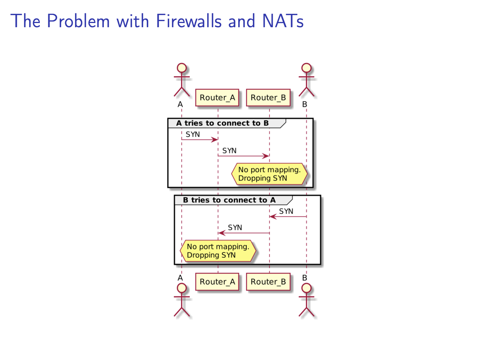
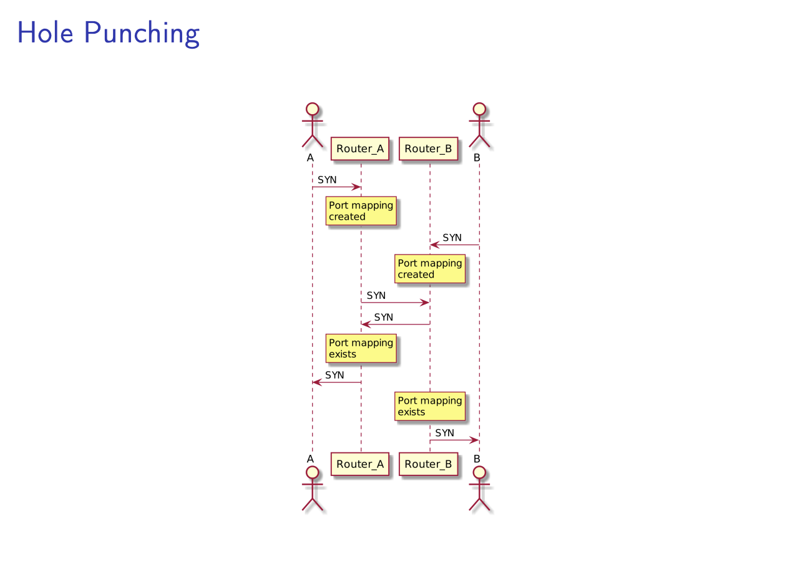
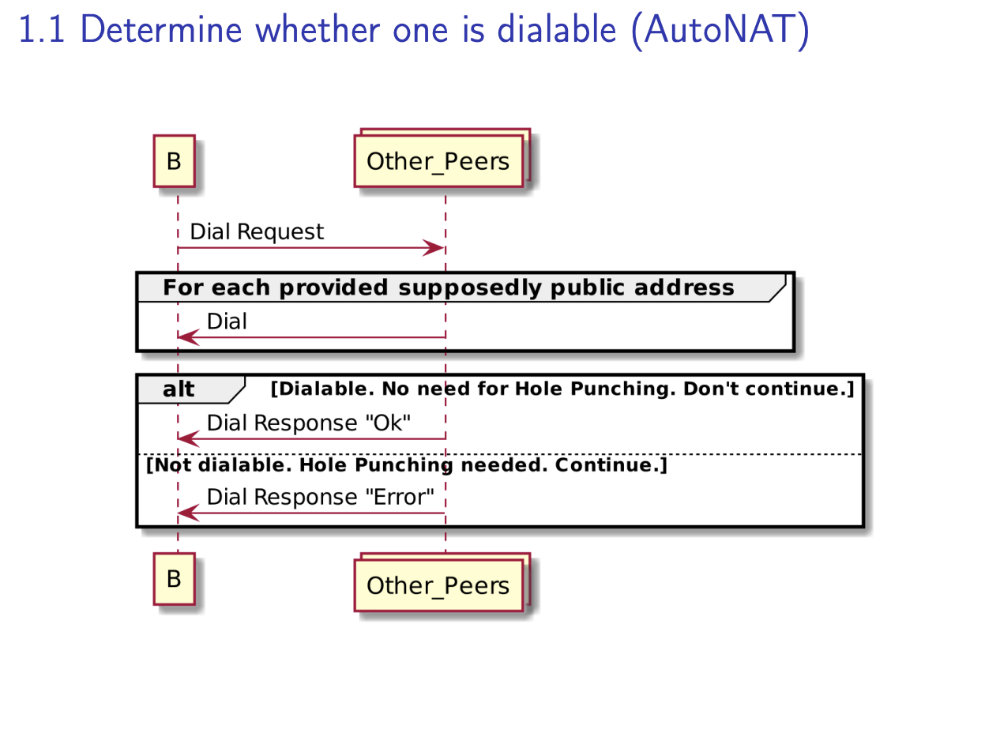
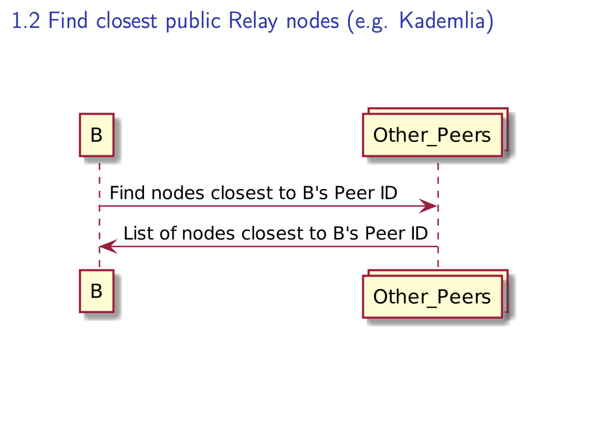
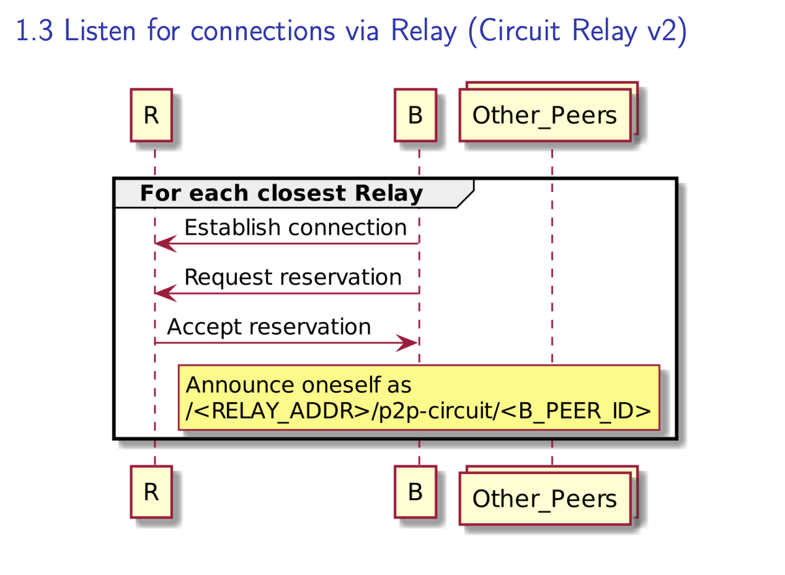
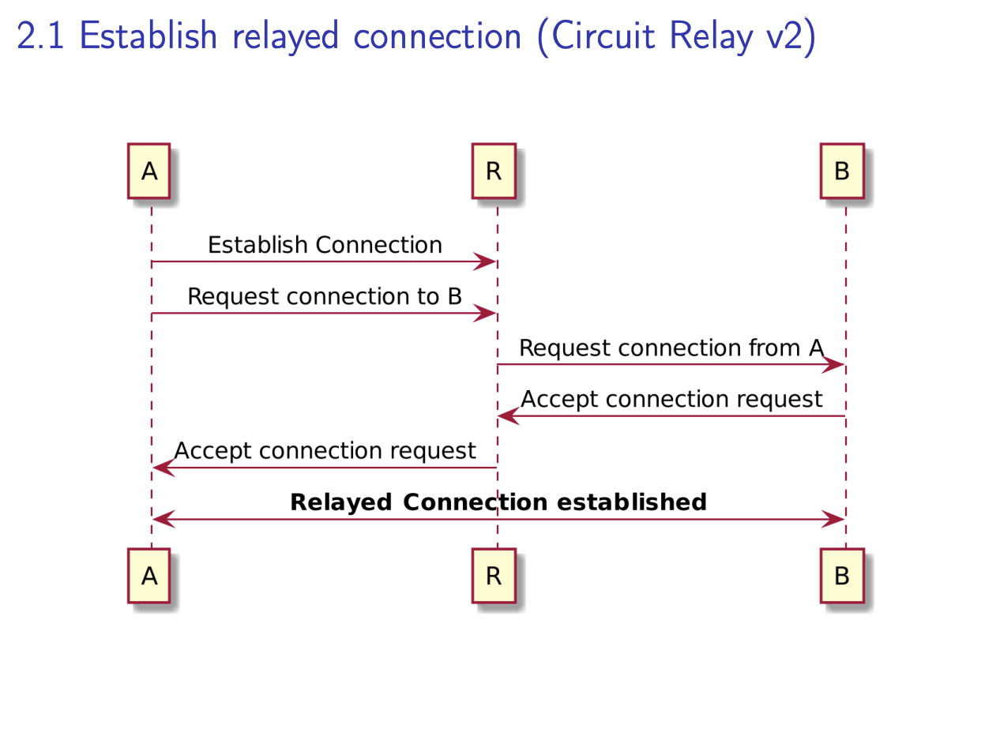
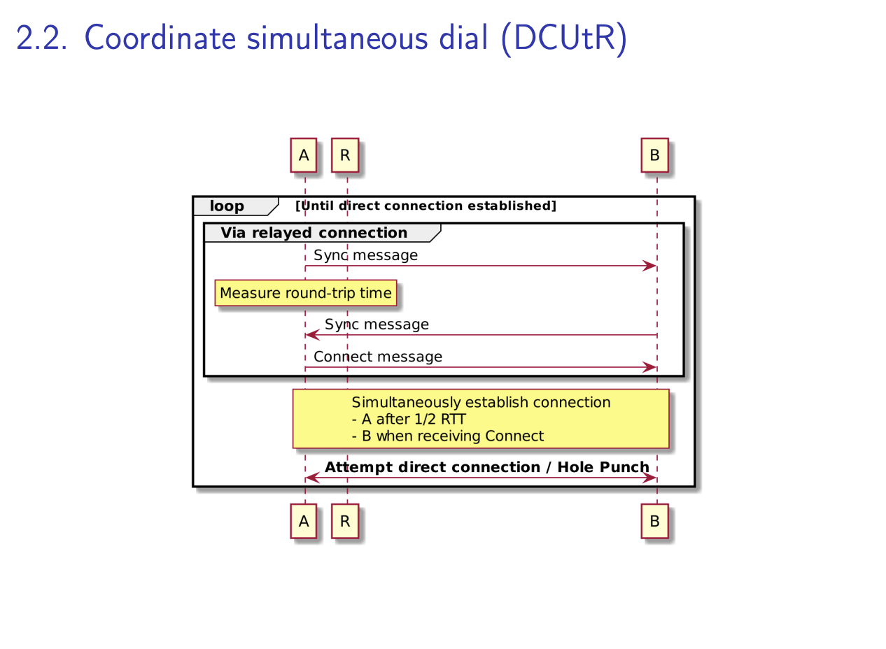

# peer to peer hole punching without centralized infracture

Introduction to libp2p2

1. A modular peer-to-peer networking stack
1. Composable building blocks based on a shared core
1. Implemented in 7+ languages
1. Runs on many runtimes: browser, mobile, embedded
1. Powers the IPFS, Ethereum 2, Filecoin and Polkadot network
1. ~100,000 libp2p2 based nodes online at any given time

## The proble with firewalls and NATs

1. Imagine you have two people. They want to connect to each other, A and B
1. Each of them have a laptop infront of them
1. They are connected to the internet over some home network with a router in between, each in separate network
1. The problem is that A cannot connect to B directly, and B cannot connect to A directly
1. Oversymplified, let's imagine that A tries establishing a SYN (TCP/IP SYN) connection to B, that SYN would be sent to router A and then forwared to router B
1. Router B will see that SYN comming from A, but would not see any SYN comming the other way, or any packets coming the other way form B to A, thus not realising a port mapping within it's state table and simply dropping the SYN

   

1. We can solve this with holepunching
1. Holepunching is to punch holes in one's firewall, A punches holes in it's own firewall and B punches holes in it's own firewall.
1. A and B through some magical mechanism connect at the same time, A sends a SYN and B sends a SYN
1. Since a holepunched in it's own firewall, the SYN arriving will see that a port mapping exists and the packet arrives
1. The two A and B, exchange their packets for TCP connection

   

## hole punching

Hole punching in libp2p is very relevant in a peer to peer space as we don't have central servers that we can rely on

**Goals:** Full connectiviy among all nodes of a libp2p2 network despite NATs and Firewalls

**Requirements**

1. No central infrustracture
1. IPv4/v6
1. QUIC/TCP or WebRTC
1. Integrate into libp2p stack

## Project flare

libp2p's way of decentralized hole punching

**Phases**

1. B preparing to be dialable
   1. Determine whether on is dialable (AutoNAT), this is like STUN in the ICE world
   1. If not, find some closest public relay nodes in the network that are public (e.g Kademlia)
   1. Listen for incoming connections via those closest relay nodes (Circuit relay v2), if you ae familiar with ICE this is like TURN
1. A connecting to B
   1. A establishes relay connection to B (Circuit relay v2)
   1. A and B coordinate simultaneous dial (DCUtR)

Current status of Project Flare

1. Works with TCP and UDP/QUIC ~90% success rate
1. Implement in Go and Rust
1. Included in IPFS
   1. Public nodes run as limited relay server, all ipfs nodes run like a stun server in the ICE world, each taking part a small part of the load
   1. Non-public nodes can punch holes

## 1.1 Determine whether a node is diable or not (AutoNAT)

The fist stage is to determine whether a node is dialable or not, this is called the autoNAT protocol.

1. B would connect to a bunch of nodes in the network, the public nodes
1. B asks thos nodes to dial it back
1. B says, I don't know whether I am public, here are all the addresses I think I am reachable under, can you try them out?
1. The other nodes would try to dial B, and if they succeed, they will respond to B with yes I was able to dial you, this was the other adderess I was able to reach you under
1. Or No, I was not able to dial you at all
1. If B is not dialable now we need the whole holepunching stack

## 1.2 Find closest puclic realy nodes (Kademlia)

Since B is not dialable it will need to find some relay nodes

1. B in IPFS will search the Kademlia DHT, kind of like a blackbox for now, B will try to find the closest nodes within the network
1. B will find the closest public nodes that also offer the relay protocol and then move on to the next step

- See talk at [Kademlia Conf](https://kademlia.notion.site/KademliaCon-Links-Slides-and-Recordings-065487dca2ce4cc1a699d775331d269a)

## 1.3 Listen for connections via relay (circuit relay v2)

1. For the relays found in 1.2, it will connect to each of them,
1. B will establish connections to R, and request a reservation
1. The reservation would say, hey i'm B, I am not reacheable through the public internet or no one can dial me, would you, dear R, as a public node, listen for incoming connections on my behalf, and then notify me whenever something like that comes in
1. R gets the reservation request and accepts it
1. From now on, there are two things happening, B is keeping a constant connection to R, and B can now announce itself not by its own address but through a relay address since its address is unreacheable and pretty useless
1. B says, hey i'm B, i'm not publicly reachable, but you via this relay address and this is my peer id, so if you tell the relay you want to connect to B, then you will ne able to find me
1. B needs to keep its connection alive to R, otherwise R will not be able to reach B because its behind a firewall

## 2.1 Establish relayed connection (curcuit relay v2)

1. A would reach out to the relay, the relay that B is listening via
1. A would establish a connection
1. A would request a connection to B from the relay
1. The relay would reach out to B, since B kept its connection alive
1. R forwards that request to B
1. B will accept the connection request
1. R forwards the acceptance request to A
1. From now on, A and B can use the relayed connection over R to exchange bytes
1. Now A has a way to communicate with B

## 2.2 Coordinate simultaneous dial (DCUtR)

> The secret sauce. This is the synchronisation step to make sure we are holepunching at the same time

1. A sends a sync message to B
1. It will start a timer, wait and measure the time until B sends the sync message back (echoing the message)
1. Through this mechanism, A notes the roundtrip time over R to B
1. Next, A will send a connect message to B, after 1/2 a round trip time (RTT) will try to dial B
1. Once B receives the connect message, will try to dial A
1. If everything works out and the RTT was correctly mesaured, this will be at the same time
1. From here now on the two will be connected real time

## Libp2p

The stack see [State of libp2p2](https://av.tib.eu/media/57050)

1. Transports
1. Secure Channels
1. Multiplexers
1. NAT Traversal
1. Discovery
1. Routing
1. Messaging
1. Data Exchange

### 1. Transports

1. Transports allow you to get bytes from one end to the other
1. Tranports is an abstraction
1. It allows you to establish connections in a dialing and listening fashion, and then send bytes over those connections
1. libp2p supports differenct transpors, TCP, QUIC, WebSockets, WebRTC, Bluetooth

### 2. Secure Channels

> Once you are able to establish a connection, and exchange bytes over that connection, we want to secure that exchange of bytes

1. libp2p uses secure channels protocol to authenticate the remote peer
1. Encrypt the data at transport
1. libp2p supports transport security protocols Noise (on TCP) and TLS 1.3 (on QUIC and UDP)

### 3. Multiplexers

> Once we establish a connection and secure it, we want to make great use of that connection and we do so with multiplexing

1. Multiplexing allows us to run multiple logical connections over a single connection
1. Establishing a connection is not that cheap, because of the handshakes and hole puch to that other node which inolves many round trips to different nodes in the network
1. Since setting up a connection is expensive, we want to make use of that connection
1. We do multiplexing which enables applications to have and 'isolated' connection on top of another conncetion, shared with other applications
1. Application can leverage already established connections (re-using established connections for several protocols)
1. We can do full control over that multiplex streams
1. We have several implementations for multiplexers, e.g Yamux, Mplex, for QUIC you native support for multiplexing buildin

### 4. NAT Traversal

> Now that we know how to establish a connection, but we may still not be able to establish a connection because of NATs and firewalls

### 5. Peer Discovery

> Within your network ,you probably want peers to discover other peers

1. You can do peer discovery withing your lan wiht Multiocast DNS (mDNS)
1. We have Rendezvous implementation, which is similar to a bootstrap node where you go to that node and it tells you about a bunch of other peers within the network
1. we also have random peer discovery build into other protocols, for example gossipsub, which would enable you as a gossipsub user to then exchange peers other peers around you

### 6. Routing

1. Once you discovered peers, you might also want to route to specific peers, or route to specific content within the network
1. libp2p offers a DHT implementation mainly based on the [Kademlia paper](https://pdos.csail.mit.edu/~petar/papers/maymounkov-kademlia-lncs.pdf)
1. Kademlia enables you to find nodes, FIND_NODE
1. Allows you to store data on the DHT, GET_VALUE and PUT_VALUE
1. Allows you to find providers of certain data, GET_PROVIDER and PUT_PROVIDER

### 7. Messaging - Gossipsub

1. Gossipsub enables you to send gossip style communication
1. Brokerless, self-regulating, no global knowledge
1. It pushes messages to the nodes it knows are interested in that data
1. It lets other nodes lazily pull that data
1. This enables to you to achieve kinds of security protocols
1. Use cases: IPNS, content addressing, blockchain consensus, message dissemination etc.

see: [Gossip-Sub: Attack-Ressilient Message Propagation in the Filecoin and ETH2.0 Networks](https://arxiv.org/pdf/2007.02754.pdf)

### 8. Data Exchange - Bitswap

> Bitswap is the data exchange protocol

1. Bitswap is a message-oriented protocol
1. Exchange blocks of data
1. Requests, WANT-HAVE, WANT-BLOCK, CANCEL
1. Responses, HAVE, BLOCK, DONT_HAVE

see: [Accelerating Content Routing with Bitswap: A multi-path file transfer protoocl in IPFS and FIlecoin](https://research.protocol.ai/publications/accelerating-content-routing-with-bitswap-a-multi-path-file-transfer-protocol-in-ipfs-and-filecoin/delarocha2021.pdf)

Other paper: [Range-Based set reconsiliation and authenticated set representations](https://arxiv.org/pdf/2212.13567.pdf)
